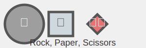

Certainly! Here’s a detailed README # Rock, Paper, Scissors Game 🪨📄✂️
---
[In Python](https://github.com/mdriyadkhan585/rock-paper-scissors-python)



---
Welcome to the Rock, Paper, Scissors game! This is a simple command-line game where you play against the computer. Choose Rock, Paper, or Scissors, and see who wins!

## Table of Contents 📚

1. [Introduction](#introduction)
2. [Features](#features)
3. [How to Run](#how-to-run)
4. [Gameplay Instructions](#gameplay-instructions)
5. [Code Explanation](#code-explanation)


## Introduction

This project is a basic implementation of the Rock, Paper, Scissors game in C. It demonstrates fundamental concepts such as user input, random number generation, and simple decision-making.

## Features 🌟

- Play Rock, Paper, Scissors against the computer 🤖
- Clear and informative output 💬
- Randomized computer choices 🎲
- Simple and easy-to-understand code 🧩

## How to Run 🚀

1. **Clone the Repository:**
   ```bash
   git clone https://github.com/mdriyadkhan585/rock-paper-scissors-C.git
   ```

2. **Navigate to the Project Directory:**
   ```bash
   cd rock-paper-scissors-C
   ```

3. **Compile the Code:**
   Use a C compiler like `gcc`:
   ```bash
   gcc -o rock_paper_scissors rock_paper_scissors.c
   ```

4. **Run the Program:**
   ```bash
   ./rock_paper_scissors
   ```

## Gameplay Instructions 🎮

1. **Start the Game:**
   After running the program, you’ll be prompted to enter your choice.

2. **Enter Your Choice:**
   - Type `0` for Rock 🪨
   - Type `1` for Paper 📄
   - Type `2` for Scissors ✂️

3. **View the Results:**
   The program will display the computer's choice and the result of the game (win, lose, or tie).

4. **Play Again:**
   You can run the program again to play another round.

## Code Explanation 🛠️

1. **Getting the Computer's Choice:**
   ```c
   int getComputerChoice() {
       return rand() % 3; // 0 = Rock, 1 = Paper, 2 = Scissors
   }
   ```

2. **Determining the Winner:**
   ```c
   void determineWinner(int playerChoice, int computerChoice) {
       // Compares choices and prints the result
   }
   ```

3. **User Input and Validation:**
   - Prompts the user to enter their choice
   - Validates the input to ensure it's between 0 and 2

4. **Formatted Output:**
   - Displays user and computer choices
   - Announces the result in a clear and engaging format
---
